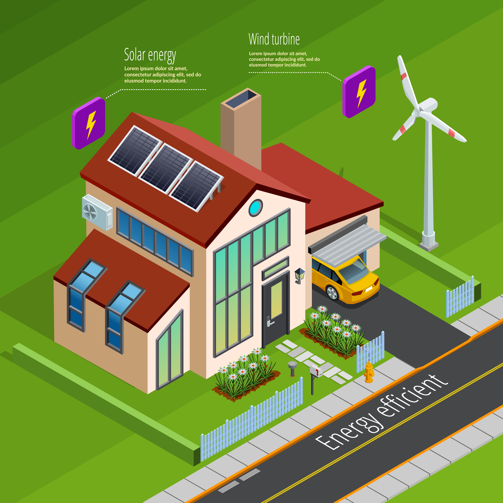
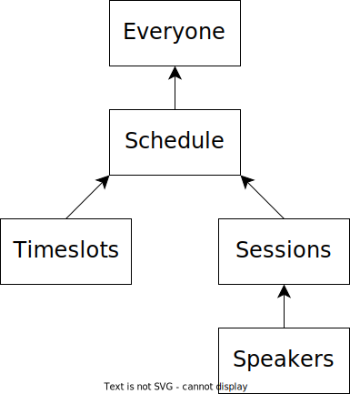
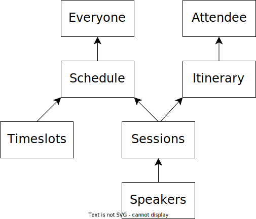
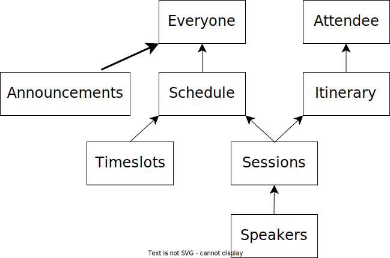
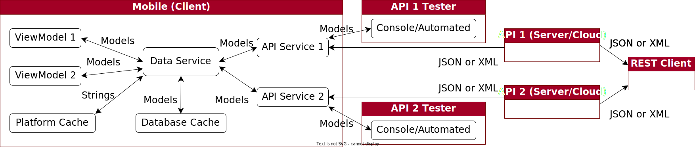

<!-- Title -->

<!-- _footer: "" -->
<!-- _paginate: skip -->

<!-- _class: talk_title invert -->

# The Secret to Mobile

- API Design
- App Architecture
- Data Handling

<p />

## Andy Lech

---

<!-- Sponsors -->

<!-- ###


--- -->

<!-- Page 0 - Topics -->

<!-- _class: talk_topics -->

### Topics

- Infrastructure differences between Web and Mobile
- Architecting your Mobile app for better results
- Making better data decisions for your Mobile app
- Replacing exceptions with extensible error models

---

<!-- Page 1 - Title -->

<!-- _class: section_title -->

## Part 1

* ### Imagine your house was an app ...

---

<!-- Page 1 - House - User -->

<!-- _class: details -->


<div>

### Energy - User

##### *[Web Site, SPA, or Mobile User]*

- Energy Consumption
  - Just Works
- Energy Production
  - Somebody Else's Problem
- Resiliency
  - Generator (Maybe?)
- <b>Focus</b>
  - <b>Living My Best Life</b>

</div>

<div class="attribution">
    <a href="https://www.freepik.com/free-vector/isometric-house-profile-concept_4278104.htm">
    Image by macrovector</a> on Freepik
</div>

---

<!-- Page 1 - House - Grid -->

<!-- _class: details -->


<div>

### Energy - Power Grid

##### *[Web Site or (Single Page Application) SPA]*

- User Consumption
  - Always
- Grid Production
  - Our Problem
- Resiliency
  - Our Backups Have Backups (Hopefully)
- <b>Focus</b>
  - <b>Keeping the Lights On (Literally)</b>

</div>

<div class="attribution">
    <a href="https://www.freepik.com/free-vector/plumbing-problems-solution-isometric-infographic-poster_4283915.htm">
    Image by macrovector</a> on Freepik
    <br />
    <i>[Equivalent energy image not available]</i>
</div>

---

<!-- Page 1 - House - Solar -->

<!-- _class: details -->



<div>

### Energy - Solar/Wind

###### *[Mobile App]*

- Energy Production
  - Local
- Grid Consumption
  - Backup
- Grid Production
  - Their Problem
- Resiliency
  - Battery, Power Grid
- <b>Focus</b>
  - <b>Smartly Using and Storing Energy</b>

</div>

<div class="attribution">
    <a href="https://www.freepik.com/free-vector/isometric-modern-house_1086482.htm">
    Image by macrovector</a> on Freepik
</div>

---

<!-- Page 2 - Title -->

<!-- _class: section_title -->

## Part 2

* ### Mobile is just like Web but smaller,

* ### right!?

* ### or

* ### Web devs make bad Mobile devs

* ### ... but they can learn

---

<!-- Page 7 - Web vs Mobile - High-level -->

<!-- _class: details -->

### Web vs Mobile - High Level


<div class="commentary" style="padding: 20px 0px 0px;">

* Same thing, right? Problem solved! Crisis averted!
Thank you and good night!

</div>

---

<!-- Page 8 - Web vs Mobile - Tech Stack (.NET) -->

<!-- _class: summary -->

### Web vs Mobile - Tech Stacks (.NET)

- Languages: C#, LINQ, F#, VB.NET, etc.
- Frameworks: .NET, Entity Framework, etc.
- Data: SQL Server, Azure, etc.
- IDEs: Visual Studio, Visual Studio Code, Rider, etc.
- Tools: ReSharper, (IDE) Extensions, etc.

</div>

---

<!-- Page 9 - Web Sites (Traditional) - Architecture -->

<!-- _class: details -->

### Web Sites (Traditional)

<p/>


<div class="detail-summary">

- Server/cloud stack is the focus here, turning data into pages and layouts
- Complex layouts are generally built on top of templating frameworks
- <b>Web devs expect fat data pipes in the server/cloud stack to get large data payloads (object graphs) to choose what to filter/display in page layouts</b>

</div>

---

<!-- Page 10 - Web Sites (Traditional) - Summary -->

<!-- _class: details -->

### Web Sites (Traditional)

<div class="two-columns">

<div>

#### *Browser (Client)*

- Requests: Browse, Submit
- State Management: Cookies
- Data Mapping: None
- Caching: Local, Session, Cookies
- Resiliency: Browser
- <b>Dev Focus: Interactivity, Data Updates</b>
- <b>Data Goal: Fat Data Pipes (to Site)</b>

</div>

<div>

#### *Site (Server/Cloud)*

- Responses: Page Layouts (Whole)
- State Management: Server/Cloud
- Data Mapping: Source to Site
- Caching: Server/Cloud
- Resiliency: Server/Cloud, Services
- <b>Dev Focus: Layouts, State, Services</b>
- <b>Data Goal: Fat Data Pipes (inside Site)</b>

<span class="break" />

</div>

</div>

---

<!-- Page 13 - Mobile Apps - Architecture -->

### Mobile Apps

<!-- _class: details -->


<div class="detail-summary">

- App handles interactivity, page layouts, local caching, and API calls
- API stack delivers only data or status codes in response to app requests
- App pages tend to be focused on single tasks that call the API selectively
- <b>Mobile/API devs focus more on reliable, just-in-time data delivery</b>

</div>

---

<!-- Page 14 - Mobile Apps - Summary -->

<!-- _class: details -->

### Mobile Apps

<div class="two-columns">

<div>

#### *App (Client)*

- Requests: API Calls
- State Management: ViewModels, Cache
- Data Mapping: API to App
- Caching: Platform, Local DB
- Resiliency: Network State
- <b>Dev Focus: Interactivity, Data Updates, Layouts, State, API Calls</b>
- <b>Data Goal: Smart Data Pipes (to API)</b>

</div>

<div>

#### *API (Server/Cloud)*

- Responses: Data (JSON/XML)
- State Management: Auth Tokens
- Data Mapping: Source to API
- Caching: Server/Cloud
- Resiliency: Server/Cloud, Services
- <b>Dev Focus: Data, Status Codes, Messages</b>
- <b>Data Goal: Smart Data Pipes (from App)</b>

</div>

</div>

---

<!-- Page 15 - Part 3 Title -->

<!-- _class: section_title -->

## Part 3

* ### "It's the data, stupid"

* ### Insert picture of James Carville

* ### Insert picture of The War Room whiteboard

---

<!-- Page 16 - API Design - Conference - Schedule -->

<!-- _class: details -->

#### API Design - Conference - Schedule

<div class="two-columns" style="padding: 40px 0px;">

<div>

##### *Requirements*

- Everybody gets the same schedule
- The schedule changes infrequently
- When the schedule does change, it often involves multiple sessions
- Event Wi-Fi is notoriously fickle

<br />

##### *Solution*

* Send whole schedule w/o redundant data but time-gated and cached

</div>

<div>



</div>

---

<!-- Page 17 - API Design - Conference - Itinerary -->

<!-- _class: details -->

#### API Design - Conference - Itinerary

<div class="two-columns" style="padding: 40px 0px;">

<div>

##### *Requirements*

- Everybody gets the same schedule
- Attendee adds sessions to itinerary
- Attendee shares their itinerary
- Event Wi-Fi is still fickle

<br />

##### *Solution*

* Send itinerary as updated when network is available, managing sync

</div>

<div>



</div>

---

<!-- Page 18 - API Design - Conference - Announcements -->

<!-- _class: details -->

#### API Design - Conference - Announcements

<div class="two-columns" style="padding: 30px 0px;">

<div>

##### *Requirements*

- Everybody gets the same schedule
- Everybody needs to get the same announcements
- Event Wi-Fi is more fickle now that everybody is checking their phones

<br />

##### *Solution*

* Use a highly-available service
* Poll API or wait for real-time data
* Or hope Slack, Twitter, etc. are up

</div>

<div>



</div>

---

<!-- Page 19 - Mobile Architecture - High-Level -->

<!-- _class: details -->

## Mobile Architecture - High Level

<br />


---

<!-- Page 21 - Mobile Architecture - Real World (cont.) -->

<!-- _class: details -->

## Mobile Architecture - Real-world

<div style="padding: 20px 0px;">

- ViewModels
  - Moving navigation out of the View allows ViewModels to be tested individually with frameworks like ReactiveUI (RxUI)
- Api Services
  - Individually testable to return app Models and not just Data Transfer Objects (DTOs)
- Data Service
  - Decides whether to call the local cache DB, the platform cache, an API endpoint, or a service based on the requested data and the app lifecycle

</div>

---

<!-- Page 22 - Mobile Architecture - Real World -->

<!-- _class: details -->

## Mobile Architecture - Real-world

<br />



---

<!-- Page 23 - API Design + App Design - Other Things -->

<!-- _class: details -->

#### API Design + App Design - Other Things

<div class="two-columns" style="padding: 30px 0px;">

<div>

##### *App Design*

- Centralized analytics
- Centralized logging
- Auto-generated API wrappers (Refit)
- Centralized API retry (Polly)
- Platform customizations (Xamarin.Essentials)
- Platform dependency-injection

</div>

<div>

##### *API Design*

- Authorization tokens
- Refresh tokens
- eTags
- Idempotency
- HTTP status codes
- ProblemDetails
- ValidationProblemDetails

</div>

</div>

<div class="detail-summary"
    style="padding: 1en 0px 0px !important; align: center !important;">

And so much more

</div>

---

<!-- Page 24 - Part 4 Title -->

<!-- _class: section_title -->

## Part 4

* ### Explain yourself, dammit

* ### Insert picture of Lewis Black

---

<!-- Page 25 - ProblemDetails -->

<!-- _class: details -->

<div class="two-columns" style="padding: 30px 0px;">

<div>

#### ProblemDetails

##### *Pros*

- Extensible JSON object
- Provides context to status code
- Can report errors or warnings
- Supported in .NET without ASP.NET
- Returned by Refit's ApiException

##### *Cons*

- Buggy in ASP.NET (still)
- .NET implementations follow JSON

</div>

<div>

```json
# NOTE: '\' line wrapping per RFC 8792
{
  "$schema": "https://json-schema.org/draft/2020-12/schema",
  "title": "An RFC 7807 problem object",
  "type": "object",
  "properties": {
    "type": {
      "type": "string",
      "format": "uri-reference",
      "description": "A URI reference that identifies the \
problem type."
    },
    "title": {
      "type": "string",
      "description": "A short, human-readable summary of the \
problem type."
    },
    "status": {
      "type": "integer",
      "description": "The HTTP status code \
generated by the origin server for this occurrence of the problem.",
      "minimum": 100,
      "maximum": 599
    },
    "detail": {
      "type": "string",
      "description": "A human-readable explanation specific to \
this occurrence of the problem."
    },
    "instance": {
      "type": "string",
      "format": "uri-reference",
      "description": "A URI reference that identifies the \
specific occurrence of the problem. It may or may not yield \
further information if dereferenced."
    }
  }
}
```

</div>

</div>

<!-- Page 26 - Demo - ProblemReports (PdHelpers) -->

<!-- # _class: details -->

<!-- ### Demo - ProblemReports (PdHelpers) -->

---

<!-- Page 27 - Questions? -->

<!-- _class: title -->

## Part 5

### Questions?
