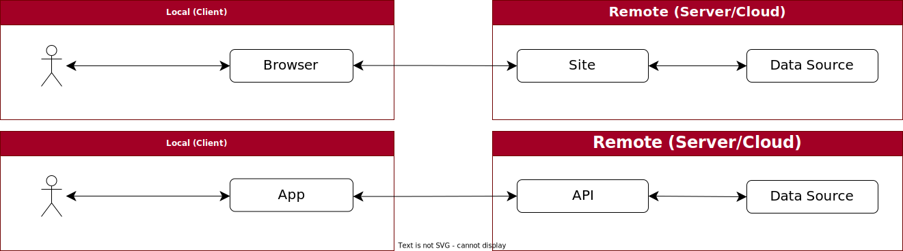

<!-- Title -->

<!-- _footer: "" -->
<!-- _paginate: skip -->

<!-- _class: talk_title invert -->

# The Secret to Mobile

- API Design
- App Architecture
- Data Handling

<p />

## Andy Lech

---

<!-- Sponsors -->

### Atl Dev Con 2023 Sponsors


---

<!-- Page 1 - Topics -->

<!-- _class: talk_topics -->

### Topics

- Infrastructure differences between Web and Mobile
- Architecturing your Mobile app for better results
- Making better data decisions for your Mobile app
- Replacing exceptions with extensible error models

---

<!-- Page 2 - Part 1 Title -->

<!-- _class: section_title -->

### Part 1

* ### Imagine your house was an app ...

---

<!-- Page 3 - House - User -->

<!-- _class: details -->


<div>

### <i>User Perspective</i>

- Roof: Has One
- Foundation: Has One
- Energy Consumption: Just Works
- Energy Production: Somebody Else's Problem
- Resiliency: Generator (Maybe?)
- Focus: Amenities, Location, My Stuff is Here

</div>

<div class="attribution">
    <a href="https://www.freepik.com/free-vector/isometric-house-profile-concept_4278104.htm">
    Image by macrovector</a> on Freepik
</div>

---

<!-- Page 4 - House - Grid -->

<!-- _class: details -->


<div>

### <i>Energy Perspective (Power Grid)</i>

- Foundation/Roof: Primary Access
- Energy Consumption: Always
- Energy Production: Our Problem
- Resiliency: Our Backups Have Backups (Hopefully)
- Focus: Keeping the Lights On (Literally)

</div>

<div class="attribution">
    <a href="https://www.freepik.com/free-vector/plumbing-problems-solution-isometric-infographic-poster_4283915.htm">
    Image by macrovector</a> on Freepik
</div>

---

<!-- Page 5 - House - Solar -->

<!-- _class: details -->


<div>

### <i>Energy Perspective (Solar)</i>

- Roof: Primary Access (Solar)
- Foundation/Roof: Secondary Access (Power Grid)
- Power Grid Consumption: Backup
- Power Grid Production: Their Problem
- Resiliency: Battery, Power Grid
- Focus: Smartly Converting and Storing What I Get From The Sun

</div>

<div class="attribution">
    <a href="https://www.freepik.com/free-vector/isometric-modern-house_1086482.htm">
    Image by macrovector</a> on Freepik
</div>

---

<!-- Page 6 - Part 2 Title -->

<!-- _class: section_title -->

### Part 2

* ### Mobile is just like Web but smaller

* ### Right!?

* #### or

* ### Web devs make bad Mobile devs

* ### ... but they can learn

---

<!-- Page 7 - Web vs Mobile - High-level -->

### Web vs Mobile - High Level



<div class="commentary" style="padding: 20px 0px 0px;">

* Same thing, right? Problem solved! Crisis averted!
Thank you and good night!

</div>

---

<!-- Page 8 - Web vs Mobile - Tech Stack (.NET) -->

<!-- _class: summary -->

### Web vs Mobile - Tech Stacks (.NET)

- Languages: C#, LINQ, F#, VB.NET, etc.
- Frameworks: .NET, Entity Framework, etc.
- Data: SQL Server, Azure, etc.
- IDEs: Visual Studio, Visual Studio Code, Rider, etc.
- Tools: ReSharper, (IDE) Extensions, etc.

</div>

---

<!-- Page 9 - Web Sites (Traditional) - Architecture -->

<!-- _class: details -->

### Web Sites (Traditional)


<div class="detail-summary">

- Server/cloud stack is the focus here, turning data into pages and layouts
- Complex layouts are generally built on top of templating frameworks
- Result: Web devs expect fat data pipes in the server/cloud stack to get large data payloads (object graphs) to choose what to filter/display in page layouts

</div>

---

<!-- Page 10 - Web Sites (Traditional) - Summary -->

<!-- _class: details -->

### Web Sites (Traditional)

<div class="two-columns">

<div>

#### <i>Browser (Client)</i>

- Requests: Browse, Submit
- State Management: Cookies
- Data Mapping: None
- Caching: Local, Session, Cookies
- Resiliency: Browser
- Development Focus: Interactivity, Data Updates
- Data Goal: Fat Data Pipes (to Site)

</div>

<div>

#### <i>Site (Server/Cloud)</i>

- Responses: Page Layouts (Whole)
- State Management: Server/Cloud
- Data Mapping: Source to Site
- Caching: Server/Cloud
- Resiliency: Server/Cloud, Services
- Development Focus: Layouts, State, Services
- Data Goal: Fat Data Pipes (inside Site)

<span class="break" />

</div>

</div>

---


<!-- Page 13 - Mobile Apps - Architecture -->

### Mobile Apps

<!-- _class: details -->


<div class="detail-summary">

- App handles interactivity, page layouts, local caching, and API calls
- API stack delivers only data or status codes in response to app requests
- App pages tend to be focused on single tasks that call the API selectively
- Result: mobile/API devs focus more on reliable, just-in-time data delivery

</div>

---

<!-- Page 14 - Mobile Apps - Summary -->

<!-- _class: details -->

### Mobile Apps

<div class="two-columns">

<div>

#### <i>App (Client)</i>

- Requests: API Calls
- State Management: ViewModels, Cache
- Data Mapping: API to App
- Caching: Platform, Local DB
- Resiliency: Network State
- Development Focus: Interactivity, Data Updates, Layouts, State, API Calls
- Data Goal: Smart Data Pipes (to API)

</div>

<div>

#### <i>API (Server/Cloud)</i>

- Responses: Data (JSON/XML)
- State Management: Auth Tokens
- Data Mapping: Source to API
- Caching: Server/Cloud
- Resiliency: Server/Cloud, Services
- Development Focus: Data, Status Codes and Messages
- Data Goal: Smart Data Pipes (from App)

</div>

</div>

---

<!-- Page 15 - Part 3 Title -->

<!-- _class: section_title -->

### Part 3

* ### "It's the data, stupid"

* ### Insert picture of James Carville

* ### Insert picture of The War Room whiteboard

---

<!-- Page 16 - API Design - Conference - Schedule -->

<!-- _class: details -->

#### API Design - Conference - Schedule

<div class="two-columns" style="padding: 40px 0px;">

<div>

##### <i>Requirements</i>

- Everybody gets the same schedule
- The schedule changes infrequently
- When the schedule does change, it often involves multiple sessions
- Event Wi-Fi is notoriously fickle

##### <i>Solution</i>

* Send whole schedule w/o redunant data but time-gated and cached

</div>

<div>

<div class="mermaid">
%%{init: {'theme': 'neutral',
    'themeVariables': {'labelBackgroundColor': 'transparent'}}}%%
classDiagram
    Everybody -- Schedule
    Schedule <.. Timeslots
    Schedule <.. Sessions
    Schedule <.. Speakers

</div>

</div>

---

<!-- Page 17 - API Design - Conference - Itinerary -->

<!-- _class: details -->

#### API Design - Conference - Itinerary

<div class="two-columns" style="padding: 40px 0px;">

<div>

##### <i>Requirements</i>

- Everybody gets the same schedule
- Attendee adds sessions to itinerary
- Attendee shares their itinerary
- Event Wi-Fi is still fickle

##### <i>Solution</i>

* Send itinerary as updated when network is available, managing sync

</div>

<div>

<div class="mermaid">
%%{init: {'theme': 'neutral',
    'themeVariables': {'labelBackgroundColor': 'transparent'}}}%%
classDiagram
    Individual -- Calendar
    Individual -- Schedule
    Calendar <.. Sessions
    Schedule <.. Timeslots
    Schedule <.. Sessions
    Schedule <.. Speakers

</div>

</div>

---

<!-- Page 18 - API Design - Conference - Announcements -->

<!-- _class: details -->

#### API Design - Conference - Announcements

<div class="two-columns" style="padding: 30px 0px;">

<div>

##### <i>Requirements</i>

- Everybody gets the same schedule
- Everybody needs to get the same announcements
- Event Wi-Fi is more fickle now that everybody is checking their phones

##### <i>Solution</i>

* Use a highly-available service
* Poll API or wait for real-time data
* Or hope Slack, Twitter, etc. are up

</div>

<div>

<div class="mermaid">
%%{init: {'theme': 'neutral',
    'themeVariables': {'labelBackgroundColor': 'transparent'}}}%%
classDiagram
    Individual -- Announcements
    Individual -- Calendar
    Individual -- Schedule
    Calendar <.. Sessions
    Schedule <.. Timeslots
    Schedule <.. Sessions
    Schedule <.. Speakers

</div>

</div>

---

<!-- Page 19 - Mobile Architecture - High-Level -->

<!-- _class: details -->

## Mobile Architecture - High Level


---

<!-- Page 20 - Mobile Architecture - More Detail -->

<!-- _class: details -->

## Mobile Architecture - More Detail

<div class="mermaid">
%%{init: {'theme': 'neutral',
    'themeVariables': {'labelBackgroundColor': 'transparent'}}}%%
stateDiagram
    direction LR
    [*] --> Page
    Page --> ViewModels : Binding
    ViewModels: ViewModel_1
    ViewModels: ViewModel_2
    ViewModels --> Cache : Cache
    Cache: Platform
    Cache: Local DB
    Cache --> ViewModels : Data?
    ViewModels --> Page : Model
    ViewModels --> API : Request
    API --> ViewModels : JSON
    API: API_1
    API: API_2
</div>

---

<!-- Page 21 - Mobile Architecture - Real World -->

<!-- _class: details -->

## Mobile Architecture - Real-world

<div class="mermaid">
%%{init: {'theme': 'neutral',
    'themeVariables': {'labelBackgroundColor': 'transparent'}}}%%
stateDiagram
    direction LR
    [*] --> Page
    state App_Stack_1 {
        Page --> ViewModels
        ViewModels --> DataService
        ViewModels: ViewModel_1
        ViewModels: ViewModel_2
        DataService --> Cache: Cache
        Cache: Platform
        Cache: Local DB
        Cache --> DataService : Data?
        DataService --> ApiService
        ApiService: ApiService_1
        ApiService: ApiService_2
        ApiService --> DataService : Model
        DataService --> ViewModels : Model
        ViewModels --> Page : Properties
    }
</div>

<div class="mermaid">
%%{init: {'theme': 'neutral',
    'themeVariables': {'labelBackgroundColor': 'transparent'}}}%%
stateDiagram
    direction LR
    state App_Stack_2 {
        direction LR
        ApiTester_1 --> ApiService_1
        ApiService_1 --> ApiTester_1 : Models
        ApiTester_2 --> ApiService_2
        ApiService_2 --> ApiTester_2 : Models
    }
    ApiService_1 --> Api_1
    Api_1 --> ApiService_1
    ApiService_2 --> Api_2
    Api_2 --> ApiService_2
</div>

---

<!-- Page 22 - Mobile Architecture - Real World (cont.) -->

<!-- _class: details -->

## Mobile Architecture - Real-world

<div style="padding: 20px 0px;">

- ViewModels - Moving navigation out of the View allows ViewModels to be tested individually with frameworks like ReactiveUI (RxUI)
- Api Services - Individually testable to return app Models and not just DTOs
- Data Service - Decides whether to call the local cache DB, the platform cache, an API endpoint, or a service based on the requested data and the app lifecycle

</div>

---

<!-- Page 23 - API Design + App Design - Other Things -->

<!-- _class: details -->

#### API Design + App Design - Other Things

<div class="two-columns" style="padding: 30px 0px;">

<div>

##### <i>App Design</i>

- Centralized analytics
- Centralized logging
- Auto-generated API wrappers (Refit)
- Centralized API retry (Polly)
- Platform customizations (Xamarin.Essentials)
- Platform dependency-injection

</div>

<div>

##### <i>API Design</i>

- Authorization tokens
- Refresh tokens
- eTags
- Idempotency
- HTTP status codes
- ProblemDetails
- ValidationProblemDetails

</div>

</div>

<div class="detail-summary" style="padding: 20px 0px 0px;">

- And so much more

</div>

---

<!-- Page 24 - Part 4 Title -->

<!-- _class: section_title -->

## Part 4

* ### Explain yourself, dammit

* ### Picture of Lewis Black

---

<!-- Page 25 - ProblemDetails -->

<!-- _class: details -->

<div class="two-columns" style="padding: 30px 0px;">

<div>

#### ProblemDetails

##### <i>Pros</i>

- Extensible JSON object
- Provides context to status code
- Can report errors or warnings
- Supported in .NET without ASP.NET
- Returned by Refit's ApiException

##### <i>Cons</i>

- Buggy in ASP.NET (still)
- .NET implementations follow JSON

</div>

<div>

```json
# NOTE: '\' line wrapping per RFC 8792
{
  "$schema": "https://json-schema.org/draft/2020-12/schema",
  "title": "An RFC 7807 problem object",
  "type": "object",
  "properties": {
    "type": {
      "type": "string",
      "format": "uri-reference",
      "description": "A URI reference that identifies the \
problem type."
    },
    "title": {
      "type": "string",
      "description": "A short, human-readable summary of the \
problem type."
    },
    "status": {
      "type": "integer",
      "description": "The HTTP status code \
generated by the origin server for this occurrence of the problem.",
      "minimum": 100,
      "maximum": 599
    },
    "detail": {
      "type": "string",
      "description": "A human-readable explanation specific to \
this occurrence of the problem."
    },
    "instance": {
      "type": "string",
      "format": "uri-reference",
      "description": "A URI reference that identifies the \
specific occurrence of the problem. It may or may not yield \
further information if dereferenced."
    }
  }
}
```

</div>

</div>

---

<!-- Page 26 - Demo - ProblemReports (PdHelpers) -->

<!-- _class: details -->

### Demo - ProblemReports (PdHelpers)

---

<!-- Page 27 - Questions? -->

<!-- _class: title -->

## Part 5

### Questions?

<!-- Put this script at the end of Markdown file. -->
<script type="module">
import mermaid from 'https://cdn.jsdelivr.net/npm/mermaid@10.3.1/dist/mermaid.esm.min.mjs';
mermaid.initialize({ startOnLoad: true });

window.addEventListener('vscode.markdown.updateContent', function() { mermaid.init() });
</script>
